# 오늘의 요리 DRF ver.

## 0. 목차
1. [개요](#1-개요)
2. [배포 Url 및 사용한 기술스택, 네이밍 컨벤션](#2-배포-url-및-사용한-기술스택-네이밍-컨벤션)
3. [개발 일정, 프로젝트 구조와 UI 목업 설계](#3-개발-일정-프로젝트-구조와-ui-목업-설계)
4. [요구사항 분석 및 구현 기능 설명, 플로우차트](#4-요구사항-분석-및-구현-기능-설명-플로우차트)
5. [UI 및 기능 시연](#5-ui-및-기능-시연)
6. [문제 해결 및 개발 후기](#6-문제-해결-및-개발-후기)

## 1. 개요

- **오늘의 요리**는 매 식사시간마다 무엇을 요리할 지 고민하는 사람들을 위한 웹사이트 입니다.

- 사용자가 현재 갖고 있는 **식재료들**, 현재 사용 가능한 **조리기구**, 그리고 **식재료 추가 가능 여부**를 입력받아 ChatGPT를 이용하여 현재 만들 수 있는 **레시피를 추천**해줍니다.

- 1차 프로젝트에서 진행했던 **오늘의 요리**를 Django REST framework로 재구현하고 회원관리 기능이 추가되었습니다.
  <br><br>

## 2. 배포 URL 및 사용한 기술스택, 네이밍 컨벤션

### 2-1. 배포 URL

> 링크: http://recipe-generator-s3.s3-website.ap-northeast-2.amazonaws.com/
```
<TEST 계정>
이메일: test@test.com
비밀번호: testest1234
```

### 2-2. 사용한 기술스택

- **Back-End**
  - 개발<br>
     
  
  - 배포<br>
      

- **Front-End**
  - 개발<br>
      

  - 배포<br>
    

### 2-3. 네이밍 컨벤션

- **snake_case** :  Python 변수, 함수, 파일명, 폴더명
- **PascalCase** :  클래스
- **camelCase** :  JavaScript 변수, 함수
- **kebab-case** :  URL, HTML, CSS
- **UPPER_CASE**:  상수
- **is_variable** :  Boolean 값
- **$variable** :  JavaScript HTML DOM 조작
- *Github commit*: `(Gitmoji) Type: Message`

<br><br>

## 3. 개발 일정, 프로젝트 구조와 UI 목업 설계

### 3-1. 개발 일정


### 3-2. 디렉토리 구조

```
📦<recipe-generator-v2>
 ┣ 📂BE
 ┃ ┣ 📂.config
 ┃ ┃ ┣ 📂nginx
 ┃ ┃ ┃ ┗ 📜recipe_generator.conf
 ┃ ┃ ┗ 📂uwsgi
 ┃ ┃ ┃ ┣ 📜uwsgi.ini
 ┃ ┃ ┃ ┗ 📜uwsgi.service
 ┃ ┣ 📂accounts
 ┃ ┃ ┣ 📂__pycache__
 ┃ ┃ ┣ 📂migrations
 ┃ ┃ ┃ ┣ 📂__pycache__
 ┃ ┃ ┃ ┣ 📜0001_initial.py
 ┃ ┃ ┃ ┗ 📜__init__.py
 ┃ ┃ ┣ 📜__init__.py
 ┃ ┃ ┣ 📜admin.py
 ┃ ┃ ┣ 📜apps.py
 ┃ ┃ ┣ 📜managers.py
 ┃ ┃ ┣ 📜models.py
 ┃ ┃ ┣ 📜tests.py
 ┃ ┃ ┣ 📜urls.py
 ┃ ┃ ┗ 📜views.py
 ┃ ┣ 📂recipe
 ┃ ┃ ┣ 📂__pycache__
 ┃ ┃ ┣ 📂migrations
 ┃ ┃ ┃ ┣ 📂__pycache__
 ┃ ┃ ┃ ┣ 📜0001_initial.py
 ┃ ┃ ┃ ┗ 📜__init__.py
 ┃ ┃ ┣ 📜__init__.py
 ┃ ┃ ┣ 📜admin.py
 ┃ ┃ ┣ 📜apps.py
 ┃ ┃ ┣ 📜exceptions.py
 ┃ ┃ ┣ 📜models.py
 ┃ ┃ ┣ 📜pagination.py
 ┃ ┃ ┣ 📜permissions.py
 ┃ ┃ ┣ 📜schema_examples.py
 ┃ ┃ ┣ 📜serializers.py
 ┃ ┃ ┣ 📜tests.py
 ┃ ┃ ┣ 📜urls.py
 ┃ ┃ ┗ 📜views.py
 ┃ ┣ 📂recipe_generator
 ┃ ┃ ┣ 📂__pycache__
 ┃ ┃ ┣ 📜__init__.py
 ┃ ┃ ┣ 📜asgi.py
 ┃ ┃ ┣ 📜settings.py
 ┃ ┃ ┣ 📜urls.py
 ┃ ┃ ┗ 📜wsgi.py
 ┃ ┣ 📜.env
 ┃ ┣ 📜Recipe Generator.yaml
 ┃ ┣ 📜db.sqlite3
 ┃ ┗ 📜manage.py
 ┣ 📂FE
 ┃ ┣ 📂detail
 ┃ ┃ ┗ 📜index.html
 ┃ ┣ 📂join
 ┃ ┃ ┗ 📜index.html
 ┃ ┣ 📂list
 ┃ ┃ ┗ 📜index.html
 ┃ ┣ 📂login
 ┃ ┃ ┗ 📜index.html
 ┃ ┣ 📂recipe
 ┃ ┃ ┗ 📜index.html
 ┃ ┣ 📂static
 ┃ ┃ ┣ 📂css
 ┃ ┃ ┃ ┗ 📜common.css
 ┃ ┃ ┣ 📂img
 ┃ ┃ ┃ ┣ 📜background.jpg
 ┃ ┃ ┃ ┗ 📜default.jpg
 ┃ ┃ ┣ 📂js
 ┃ ┃ ┃ ┣ 📜detail.js
 ┃ ┃ ┃ ┣ 📜index.js
 ┃ ┃ ┃ ┣ 📜join.js
 ┃ ┃ ┃ ┣ 📜list.js
 ┃ ┃ ┃ ┣ 📜login.js
 ┃ ┃ ┃ ┣ 📜logout.js
 ┃ ┃ ┃ ┣ 📜recipe.js
 ┃ ┃ ┃ ┣ 📜token.js
 ┃ ┃ ┃ ┗ 📜url.js
 ┃ ┗ 📜index.html
 ┣ 📜.gitignore
 ┣ 📜README.md
 ┣ 📜requirements.txt
 ┗ 📂venv
```

### 3-3. 데이터베이스 구조


### 3-4. URL 구조
- **Back-End**<br>
  | URL | POST | GET | PATCH | DELETE |
  | --- | --- | --- | --- | --- |
  | ‘/accounts/join/’ | 회원가입 |  |  |  |
  | ‘/accounts/login/’ | 로그인 |  |  |  |
  | ‘/accounts/logout/’ | 로그아웃 |  |  |  |
  | ‘/accounts/user/’ |  | 회원정보 가져오기 |  |  |
  | ‘/accounts/token/refresh/’ | 토큰 갱신 |  |  |  |
  | ‘/recipe/’ | 입력값과 추천받은 레시피 저장 | 유저의 레시피 목록 가져오기 |  |  |
  | ‘/recipe/*id*/’ |  | 해당 레시피 상세내용 가져오기 | 해당 레시피 입력값 수정 및 재추천 | 해당 레시피 삭제 |
  | ‘/recipe/all/’ |  |  |  | 유저의 레시피 전체삭제 |

  >[Swagger로 API 테스트하기](http://43.202.206.42/api/schema/swagger-ui) <br>
  > (레시피 관련 기능들은 오른쪽 상단 Authorize 버튼으로 토큰 값을 넣어야 작동합니다.)

  |||
  | :---: | :---: |
  | 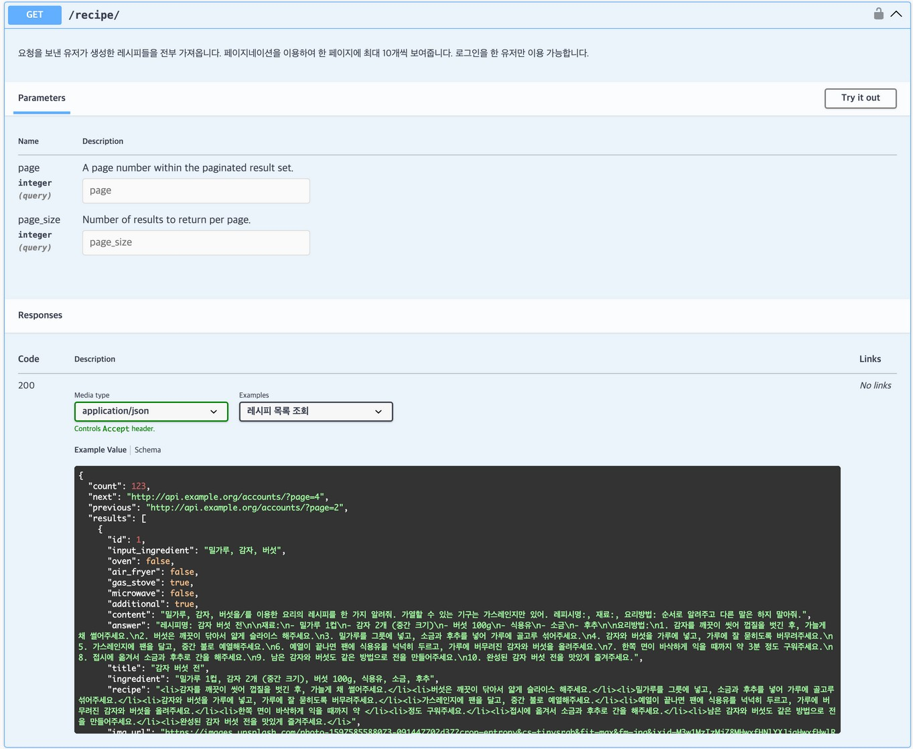<br>GET /recipe/ | 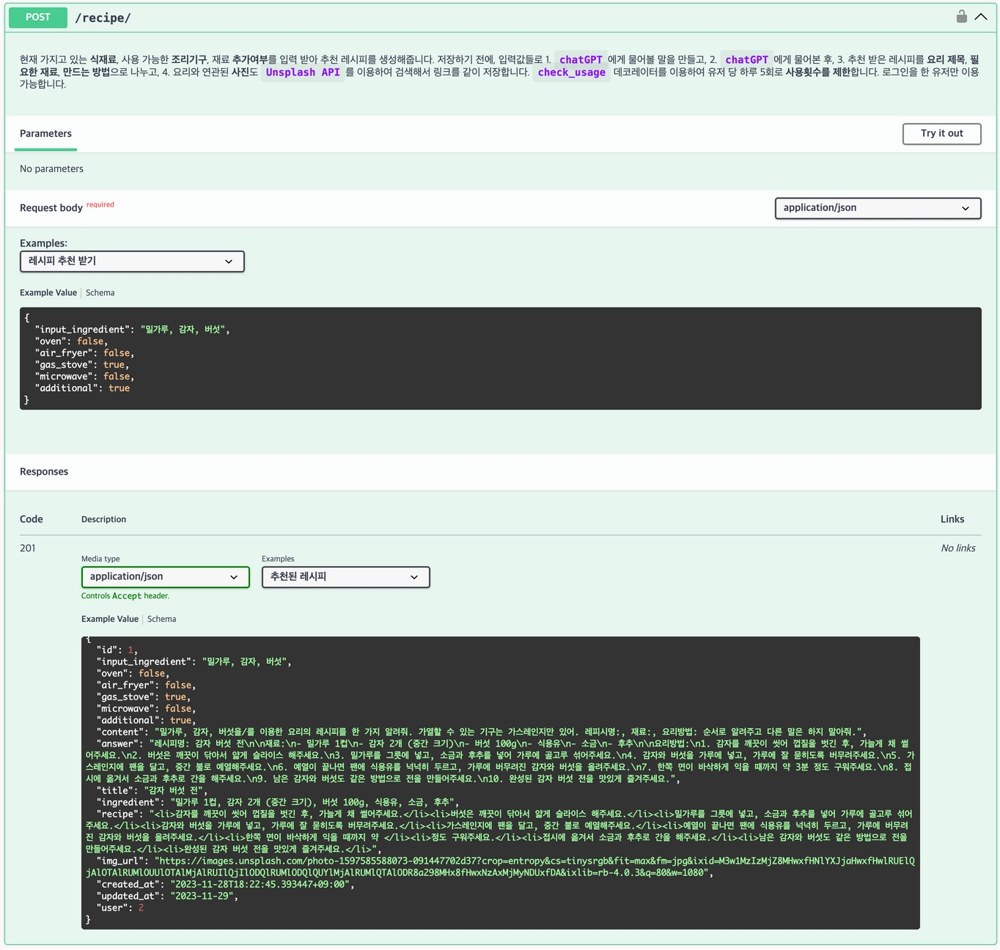<br>POST /recipe/ |
  | 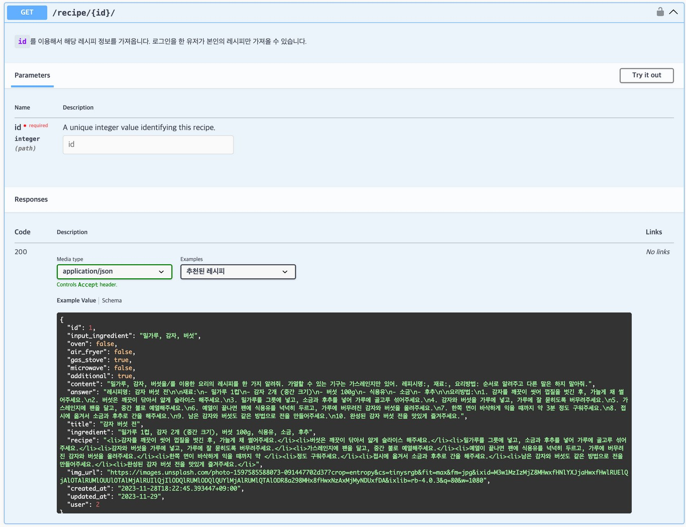<br>GET /recipe/*id*/ | 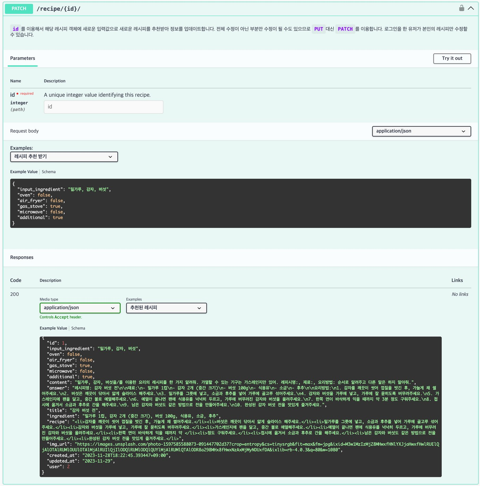<br>PATCH /recipe/*id*/ |
  | 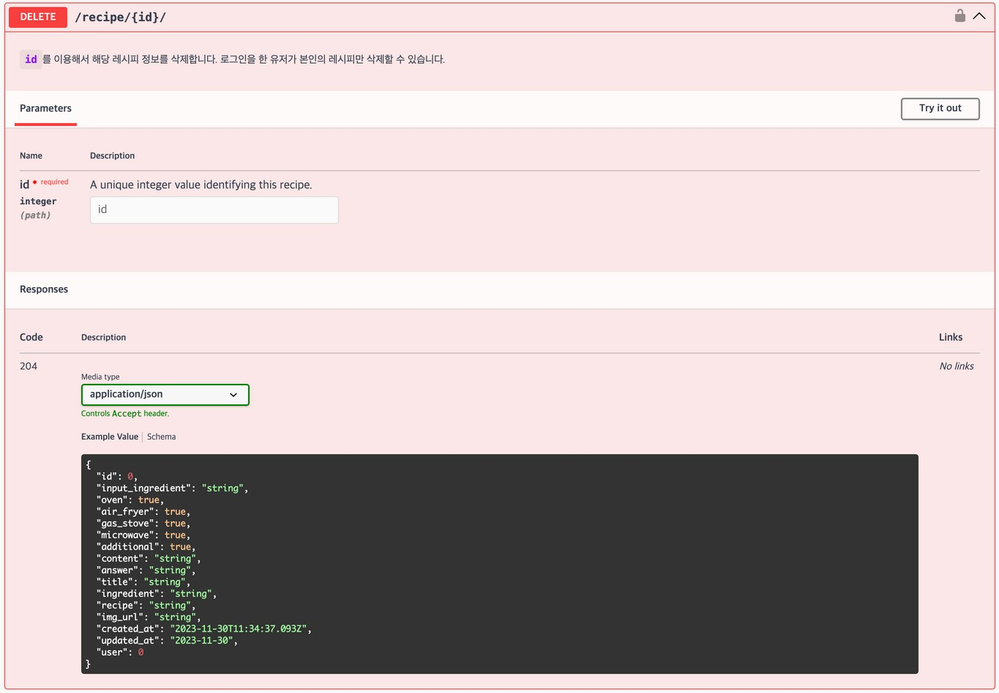<br>DELETE /recipe/*id*/ | 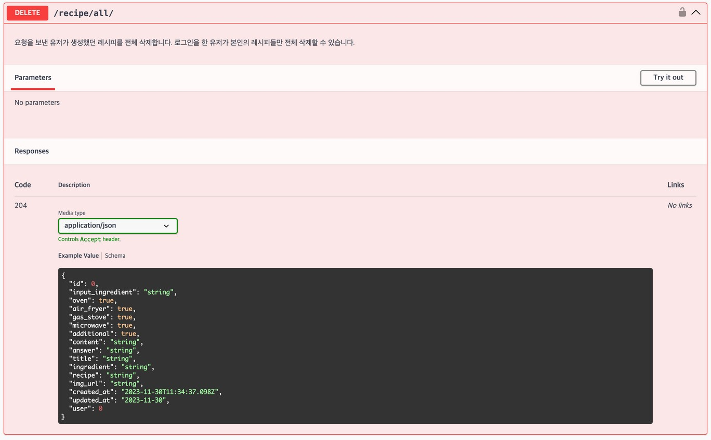<br>DELETE /recipe/all/ |

- **Front-End**
  | URL | 페이지 |
  | --- | --- |
  | / | 홈 |
  | /join/ | 회원가입 폼 |
  | /login/ | 로그인 폼 |
  | /recipe/ | 레시피 추천에 필요한 입력 폼 |
  | /detail/?id=*int* | 추천된 레시피 상세보기 |
  | /list/?page=*int* | 유저의 추천된 레시피 목록 |

### 3-5. UI 목업 설계
>[UI 목업 테스트하기](https://ovenapp.io/view/oJHlXjGbm3AI0t1XvTc68R5Yx5hZundY/55MDv)

|||||
| :---: | :---: | :---: | :---: |
| <br>홈화면(로그인X) | <br>홈화면(로그인O) | <br>로그인 화면 | <br>회원가입 화면 |
| <br>정보 입력 화면 | <br>레시피 상세보기 | <br>저장된 레시피 목록 |  |

<br><br>

## 4. 요구사항 분석 및 구현 기능 설명, 플로우차트

### 4-1. 기본 요구사항
  - Django REST framework를 이용하여 구현
  - chatGPT로 요청을 보내주는 API를 Django 내에 구현
  - 클래스형 뷰로 구현 (ViewSet 활용)
  - 유저 관리 기능 구현
  - CRUD 가능한 ERD 구조 설계
  - Front-End에서 Back-End API 호출 가능

### 4-2. `accounts` 앱
  - JSON Web Token 인증 방식으로 구현
  - 이메일, 비밀번호로 유저 생성 가능
  - Access Token 만료 시, Refresh Token을 이용하여 Access Token 재발급
  - 로그인, 회원가입, 로그아웃, 토큰 재발급, 로그인한 유저 정보 조회 가능

### 4-3. `recipe` 앱
  - 로그인 한 유저만 사용 가능 (토큰으로 인증)
  - 유저 당 하루 5번까지 요청 가능
  - 식재료, 조리기구, 재료추가여부를 입력받아 chatGPT 에게 레시피 추천 요청
  - 추천 받은 레시피를 데이터베이스에 같이 저장
  - Unsplash API를 이용하여 레시피명과 관련 있는 사진의 링크도 같이 저장
  - 저장된 레시피는 생성한 유저 본인만 조회, 수정, 삭제 가능
  - 수정 시, 수정한 입력값을 토대로 재추천하여 다시 저장
  - 목록 조회 시 페이지네이션을 이용하여 페이지 당 10개씩 조회 가능
  - 레시피 목록 조회, 상세 조회, 생성, 수정, 삭제, 전체삭제 가능

### 4-4. 배포
  - Amazon Lightsail을 이용하여 Ubuntu 서버 생성
  - Ubuntu 내부에서 uWSGI와 NGINX를 이용하여 Back-End 서버 배포
  - Amazon S3를 이용하여 Front-End 웹페이지 배포

### 4-5. 활용한 외부 패키지
  - Django REST framework 사용
    - djangorestframework
  - 회원 인증
    - djangorestframework-simplejwt
    - dj-rest-auth
    - django-allauth
  - Front-End 브라우저의 API 요청 허가
    - django-cors-headers
  - 시크릿 키, 외부 API 접근 키 관리
    - django-environ
  - API schema 문서화
    - drf-spectacular
  - chatGPT로의 요청
    - openai

### 4-6. 플로우차트
- 홈 화면
  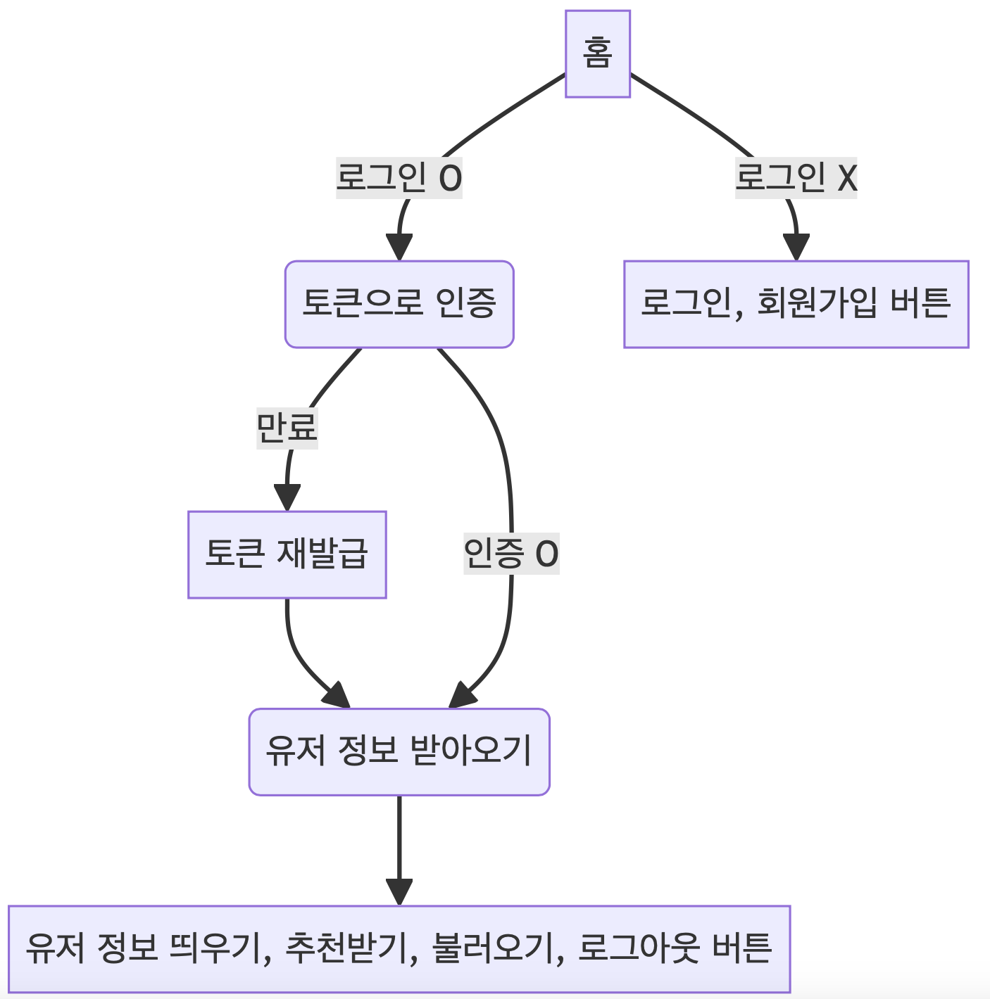

- 로그인, 회원가입
  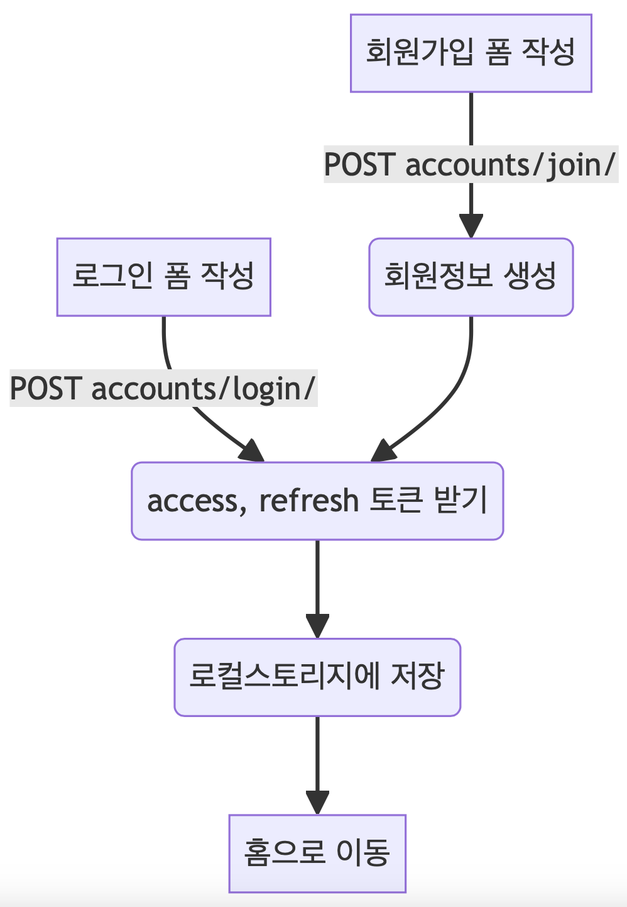

- 레시피 추천받기
  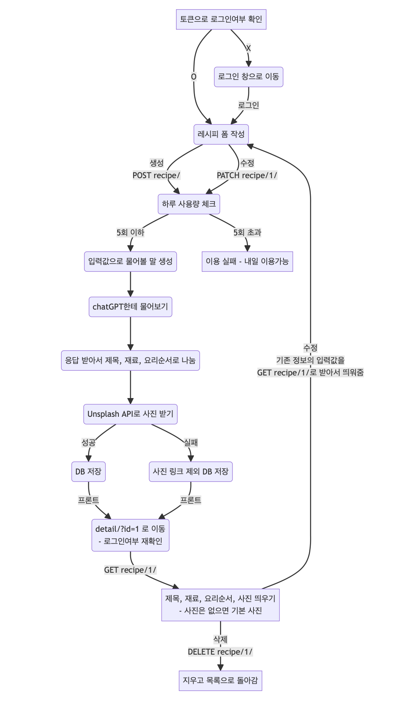

- 레시피 목록
  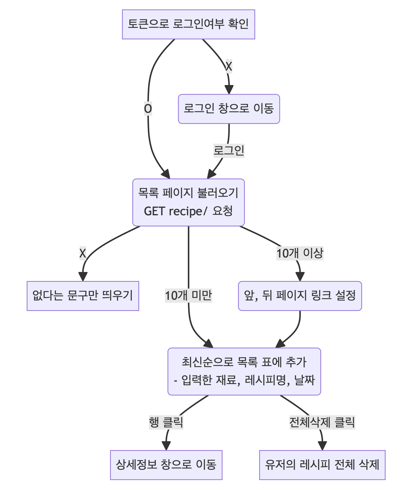

<br><br>

## 5. UI 및 기능 시연

### 5-1. 시작 페이지

**로그인 X**<br>
 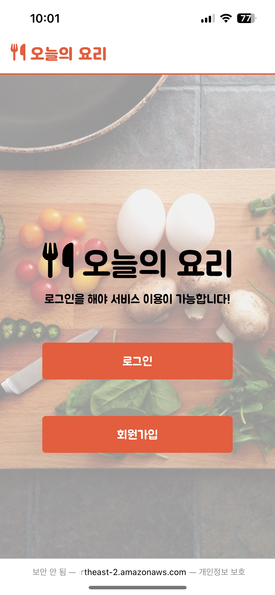
<br>

**로그인 O**<br>
 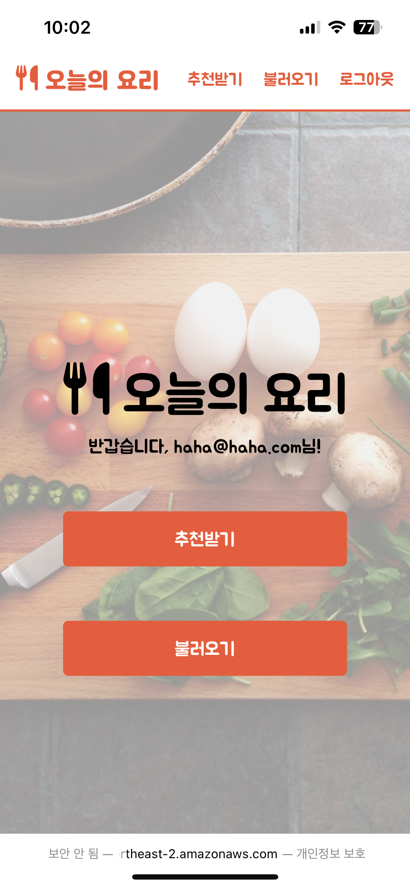
- 처음 들어갔을 때 보이는 시작 페이지입니다.
- 로그인을 안했을 때에는 `로그인`, `회원가입` 버튼이 보이고, 로그인을 했을 때는 `추천받기`, `불러오기`, `로그아웃` 버튼이 보입니다.
- 로그인을 하면 유저의 정보를 받아 이메일을 띄워줍니다.
- 모바일에서 접속 시, 작아진 화면에 맞게 반응형으로 크기를 조절하였습니다.
---

### 5-2. 회원가입 페이지
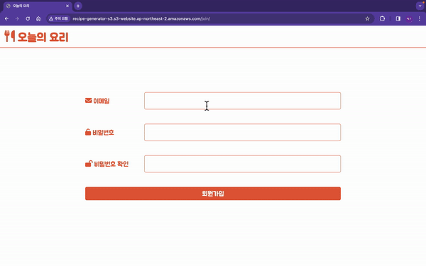 
- 폼을 이용하여 유저의 이메일과 비밀번호를 입력 받습니다.
- 회원가입 완료 시 자동 로그인되어 홈으로 이동합니다.
---

### 5-3. 로그인 페이지
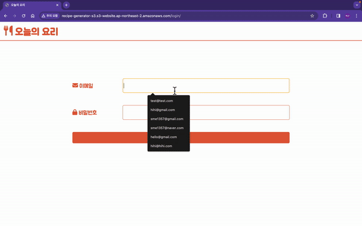 
- 폼을 이용하여 로그인을 할 수 있습니다.
- 로그인 시, Access Token과 Refresh Token이 로컬스토리지에 저장되고, 유저 인증 시 저장된 값을 불러와서 사용합니다.
- 로그인 완료 시 홈으로 이동하고, 유저 정보를 불러와서 띄워줍니다.
---

### 5-4. 추천받기 & 레시피 상세페이지
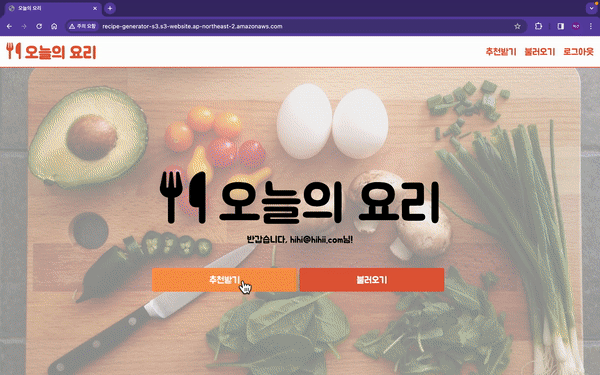 
- 추천받기 페이지에서 현재 가지고있는 식재료, 사용 가능한 조리기구(중복 선택 가능), 재료 추가여부를 입력받습니다.
- `추천`버튼을 누르면 Django 서버를 통해 chatGPT에게 추천 레시피를 물어보고, 결과를 저장합니다. (실제로는 로딩 시간이 더 깁니다.)
- 저장된 결과를 이용하여 레시피 상세페이지로 이동되어 추천된 레시피를 보여줍니다.
- 사진은 Unsplash API를 이용하여 요리 제목과 관련 있는 사진을 받아옵니다.

<br>

**횟수 초과시**<br>
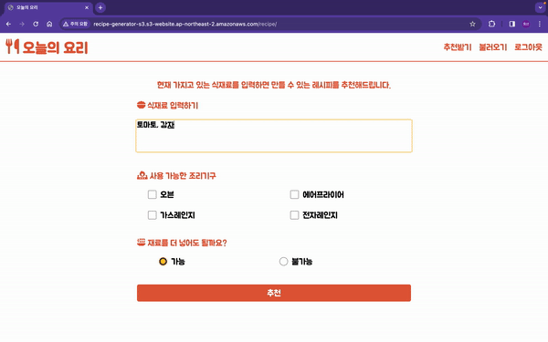 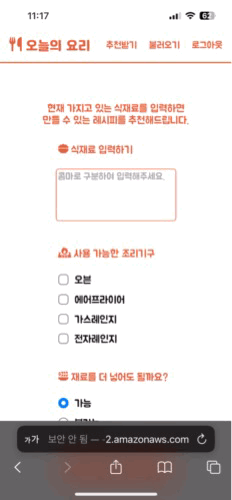
- 하루 5번까지 이용이 가능합니다.
- 횟수 초과시 이용이 불가하다는 알림이 뜨고 더 진행되지 않습니다.
---

### 5-5. 불러오기 & 수정, 삭제
 
- 저장된 레시피들은 `불러오기` 페이지에서 볼 수 있습니다.
- 본인이 추천받은 레시피들만 볼 수 있고 다른 유저의 추천받은 레시피는 볼 수 없습니다.
- 상세페이지에서 `수정`, `삭제`가 가능하고 목록페이지에서 `전체삭제`가 가능합니다.
- 10개 이상이 되면, 오른쪽 하단의 화살표 버튼으로 페이지를 앞, 뒤로 이동하여 더 볼 수 있습니다.
- 수정을 하면, 기존 값이 입력폼에 채워지고, 수정한 값으로 재추천을 받아 기존 정보가 수정됩니다.
---

<br><br>

## 6. 문제 해결 및 개발 후기
- ViewSet 내 데코레이터 구현 문제
  ```python
  # 수정 전
  def check_usage(self, func):
      def wrapper(*args, **kwargs):
          ...
          func(*args, **kwargs)
          ...
      return wrapper

  # 수정 후
  def check_usage(func):
      def wrapper(self, *args, **kwargs):
          ...
          func(self, *args, **kwargs)
          ...
      return wrapper
  ```
  1. 유저의 사용량을 체크하는 부분을 구현하다보니, chatGPT로의 요청 전에 사용량 체크를 하고, 요청 완료 후 사용량을 +1하여 chatGPT요청의 앞뒤에서 실행되므로 데코레이터로 만드는게 좋겠다고 생각이 들었습니다.
  2. `RecipeViewSet` 클래스 내부에서 정의하고 사용하다보니, `self` 인자가 필요하여 `check_usage`의 인자로 `self`를 넣었지만 안되었습니다.
  3. 하지만 이 `check_usage` 함수는 `func`의 앞뒤로 감싸주는 `wrapper` 함수만을 반환할 뿐이므로 `wrapper` 함수에 `self` 인자를 주어 해결하였습니다.

- 배포 문제
  1. 배포를 할 때, 처음에는 Amazon Lightsail의 Ubuntu 내에서 Back-End와 Front-End를 같이 배포하려고 했습니다. 보통 유저들이 Back-End 서버에는 직접적으로 접근하지 않으므로 Front-End의 기본주소가 `/` 가 되게 시도를 했습니다.
  2. 하지만 NGINX 설정에서 Front-End의 location을 `/`로 하고, Back-End의 location을 `/be/`로 하면 잘 안 되었고, 반대로 하면 가능하지만 Back-End의 admin페이지 접속이 안 됐습니다.
  3. 대안으로 Lightsail의 스토리지 버킷을 활용하려고 했는데 URL 끝에 `index.html`을 직접 붙여야 해서 저에겐 번거롭다고 느껴졌습니다.
  4. Amazon S3버킷으로 정적파일인 Front-End를 배포하고, Lightsail으로는 Back-End 서버를 배포하여 나눠서 해결하였습니다.

- 처음에는 Django 내부에서 직접 template을 쓰지 않다보니 불편하다는 생각이 들었습니다. 하지만 나눠서 하다보니 Front-End와 Back-End 둘 중 하나에서 문제가 생겨도 나머지 하나는 잘 작동을 하므로 그 문제에만 집중해서 고칠 수 있어 괜찮다는 생각도 들었습니다.

- 짧은 기간동안 Django REST framework 기능을 이용하여 직접 API서버를 개발해보니 Django에 대해 새롭게 알게되는 점도 많았고, 조금 더 익숙해졌다는 느낌이 들었습니다. 또한 JavaScript에서 서버에 fetch 통신을 하는 방법에 대해서도 여러번 사용하다보니 좀 더 익숙해졌다고 생각이 듭니다.