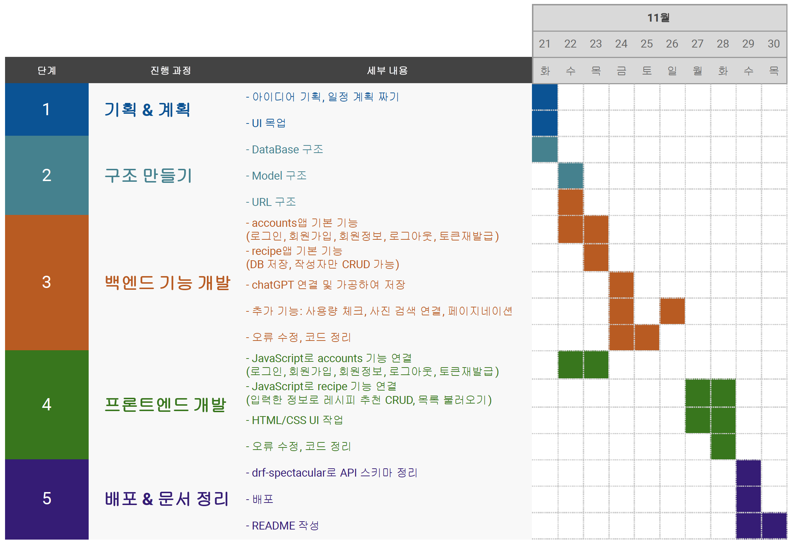
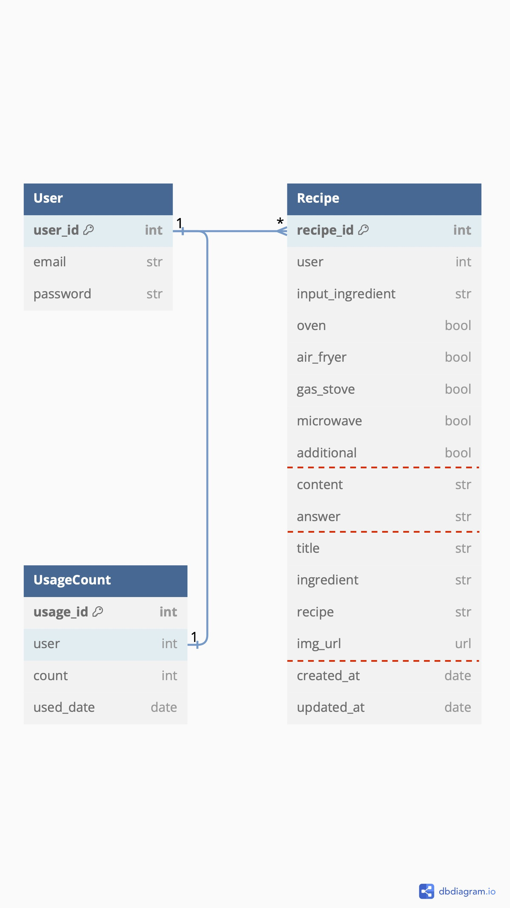
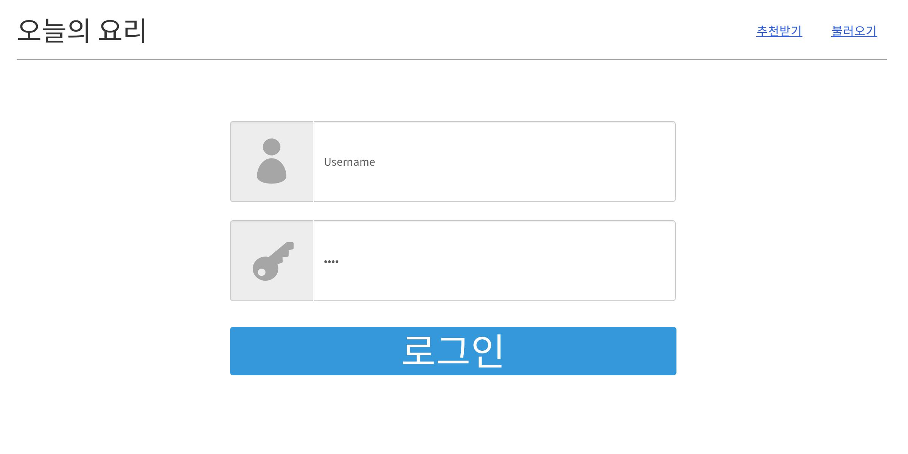
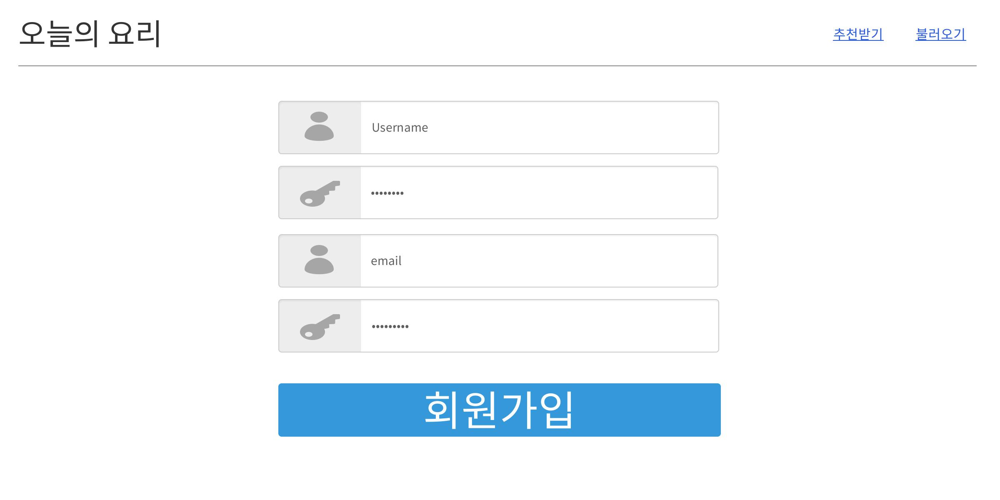
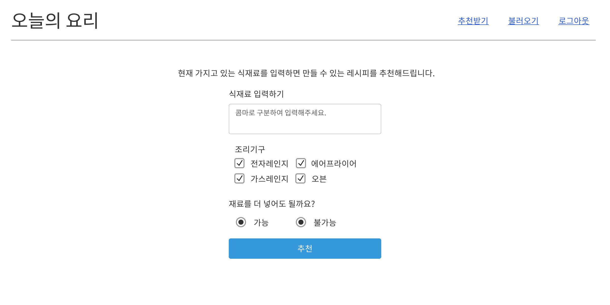
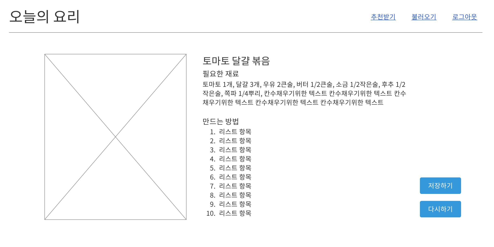
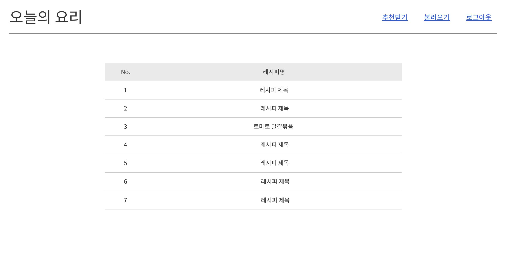

# 오늘의 요리 DRF ver.

## 0. 목차
1. [개요](#1-개요)
2. [배포 Url 및 사용한 기술스택, 네이밍 컨벤션](#2-배포-url-및-사용한-기술스택-네이밍-컨벤션)
3. [개발 일정, 프로젝트 구조와 UI 목업 설계](#3-개발-일정-프로젝트-구조와-ui-목업-설계)
4. [요구사항 분석 및 구현 기능 설명, 플로우차트](#4-요구사항-분석-및-구현-기능-설명-플로우차트)
5. [UI 및 기능 시연]()
6. [문제 해결 및 개발 후기]()

## 1. 개요

- **오늘의 요리**는 매 식사시간마다 무엇을 요리할 지 고민하는 사람들을 위한 웹사이트 입니다.

- 사용자가 현재 갖고 있는 **식재료들**, 현재 사용 가능한 **조리기구**, 그리고 **식재료 추가 가능 여부**를 입력받아 ChatGPT를 이용하여 현재 만들 수 있는 **레시피를 추천**해줍니다.

- 1차 프로젝트에서 진행했던 **오늘의 요리**를 Django Rest Framework로 재구현하고 회원관리 기능이 추가되었습니다.
  <br><br>

## 2. 배포 URL 및 사용한 기술스택, 네이밍 컨벤션

### 2-1. 배포 URL

http://recipe-generator-s3.s3-website.ap-northeast-2.amazonaws.com/
```
<TEST 계정>
이메일: test@test.com
비밀번호: testest1234
```

### 2-2. 사용한 기술스택

- **Backend**
  - 개발<br>
     
  
  - 배포<br>
      

- **Frontend**
  - 개발<br>
      

  - 배포<br>
    

### 2-3. 네이밍 컨벤션

- **snake_case** :  Python 변수, 함수, 파일명, 폴더명
- **PascalCase** :  클래스
- **camelCase** :  JavaScript 변수, 함수
- **kebab-case** :  URL, HTML, CSS
- **UPPER_CASE**:  상수
- **is_variable** :  Boolean 값
- **$variable** :  JavaScript HTML DOM 조작
- *Github commit*: `(Gitmoji) Type: Message`

<br><br>

## 3. 개발 일정, 프로젝트 구조와 UI 목업 설계

### 3-1. 개발 일정


### 3-2. 디렉토리 구조

```
📦<recipe-generator-v2>
 ┣ 📂BE
 ┃ ┣ 📂.config
 ┃ ┃ ┣ 📂nginx
 ┃ ┃ ┃ ┗ 📜recipe_generator.conf
 ┃ ┃ ┗ 📂uwsgi
 ┃ ┃ ┃ ┣ 📜uwsgi.ini
 ┃ ┃ ┃ ┗ 📜uwsgi.service
 ┃ ┣ 📂accounts
 ┃ ┃ ┣ 📂__pycache__
 ┃ ┃ ┣ 📂migrations
 ┃ ┃ ┃ ┣ 📂__pycache__
 ┃ ┃ ┃ ┣ 📜0001_initial.py
 ┃ ┃ ┃ ┗ 📜__init__.py
 ┃ ┃ ┣ 📜__init__.py
 ┃ ┃ ┣ 📜admin.py
 ┃ ┃ ┣ 📜apps.py
 ┃ ┃ ┣ 📜managers.py
 ┃ ┃ ┣ 📜models.py
 ┃ ┃ ┣ 📜tests.py
 ┃ ┃ ┣ 📜urls.py
 ┃ ┃ ┗ 📜views.py
 ┃ ┣ 📂recipe
 ┃ ┃ ┣ 📂__pycache__
 ┃ ┃ ┣ 📂migrations
 ┃ ┃ ┃ ┣ 📂__pycache__
 ┃ ┃ ┃ ┣ 📜0001_initial.py
 ┃ ┃ ┃ ┗ 📜__init__.py
 ┃ ┃ ┣ 📜__init__.py
 ┃ ┃ ┣ 📜admin.py
 ┃ ┃ ┣ 📜apps.py
 ┃ ┃ ┣ 📜exceptions.py
 ┃ ┃ ┣ 📜models.py
 ┃ ┃ ┣ 📜pagination.py
 ┃ ┃ ┣ 📜permissions.py
 ┃ ┃ ┣ 📜schema_examples.py
 ┃ ┃ ┣ 📜serializers.py
 ┃ ┃ ┣ 📜tests.py
 ┃ ┃ ┣ 📜urls.py
 ┃ ┃ ┗ 📜views.py
 ┃ ┣ 📂recipe_generator
 ┃ ┃ ┣ 📂__pycache__
 ┃ ┃ ┣ 📜__init__.py
 ┃ ┃ ┣ 📜asgi.py
 ┃ ┃ ┣ 📜settings.py
 ┃ ┃ ┣ 📜urls.py
 ┃ ┃ ┗ 📜wsgi.py
 ┃ ┣ 📜.env
 ┃ ┣ 📜Recipe Generator.yaml
 ┃ ┣ 📜db.sqlite3
 ┃ ┗ 📜manage.py
 ┣ 📂FE
 ┃ ┣ 📂detail
 ┃ ┃ ┗ 📜index.html
 ┃ ┣ 📂join
 ┃ ┃ ┗ 📜index.html
 ┃ ┣ 📂list
 ┃ ┃ ┗ 📜index.html
 ┃ ┣ 📂login
 ┃ ┃ ┗ 📜index.html
 ┃ ┣ 📂recipe
 ┃ ┃ ┗ 📜index.html
 ┃ ┣ 📂static
 ┃ ┃ ┣ 📂css
 ┃ ┃ ┃ ┗ 📜common.css
 ┃ ┃ ┣ 📂img
 ┃ ┃ ┃ ┣ 📜background.jpg
 ┃ ┃ ┃ ┗ 📜default.jpg
 ┃ ┃ ┣ 📂js
 ┃ ┃ ┃ ┣ 📜detail.js
 ┃ ┃ ┃ ┣ 📜index.js
 ┃ ┃ ┃ ┣ 📜join.js
 ┃ ┃ ┃ ┣ 📜list.js
 ┃ ┃ ┃ ┣ 📜login.js
 ┃ ┃ ┃ ┣ 📜logout.js
 ┃ ┃ ┃ ┣ 📜recipe.js
 ┃ ┃ ┃ ┣ 📜token.js
 ┃ ┃ ┃ ┗ 📜url.js
 ┃ ┗ 📜index.html
 ┣ 📜.gitignore
 ┣ 📜README.md
 ┣ 📜requirements.txt
 ┗ 📂venv
```

### 3-3. 데이터베이스 구조


### 3-4. URL 구조
- **Backend**
  | URL | POST | GET | PATCH | DELETE |
  | --- | --- | --- | --- | --- |
  | ‘/accounts/join/’ | 회원가입 |  |  |  |
  | ‘/accounts/login/’ | 로그인 |  |  |  |
  | ‘/accounts/logout/’ | 로그아웃 |  |  |  |
  | ‘/accounts/user/’ |  | 회원정보 가져오기 |  |  |
  | ‘/accounts/token/refresh/’ | 토큰 갱신 |  |  |  |
  | ‘/recipe/’ | 입력값과 추천받은 레시피 저장 | 유저의 레시피 목록 가져오기 |  |  |
  | ‘/recipe/*int*/’ |  | 해당 레시피 상세내용 가져오기 | 해당 레시피 입력값 수정 및 재추천 | 해당 레시피 삭제 |
  | ‘/recipe/all/’ |  |  |  | 유저의 레시피 전체삭제 |

- **Frontend**
  | URL | 페이지 |
  | --- | --- |
  | / | 홈 |
  | /join/ | 회원가입 폼 |
  | /login/ | 로그인 폼 |
  | /recipe/ | 레시피 추천에 필요한 입력 폼 |
  | /detail/?id=*int* | 추천된 레시피 상세보기 |
  | /list/?page=*int* | 유저의 추천된 레시피 목록 |

### 3-5. UI 목업 설계
[UI 목업 테스트하기](https://ovenapp.io/view/oJHlXjGbm3AI0t1XvTc68R5Yx5hZundY/55MDv)
|||||
| :---: | :---: | :---: | :---: |
| <br>홈화면(로그인X) | <br>홈화면(로그인O) | <br>로그인 화면 | <br>회원가입 화면 |
| <br>정보 입력 화면 | <br>레시피 상세보기 | <br>저장된 레시피 목록 |  |

<br><br>

## 4. 요구사항 분석 및 구현 기능 설명, 플로우차트

### 4-1. 기본 요구사항
### 4-2. accounts 앱
### 4-3. recipe 앱
### 4-4. 구현 로직 플로우차트